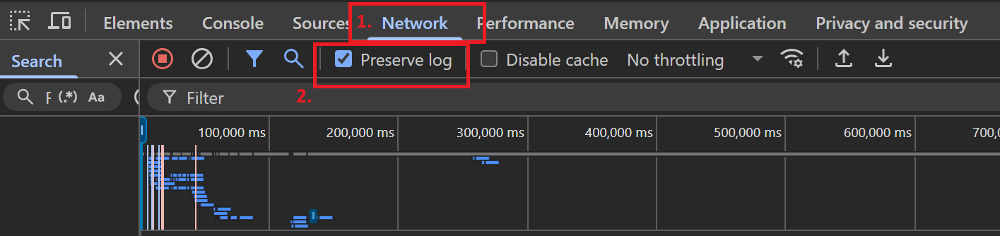
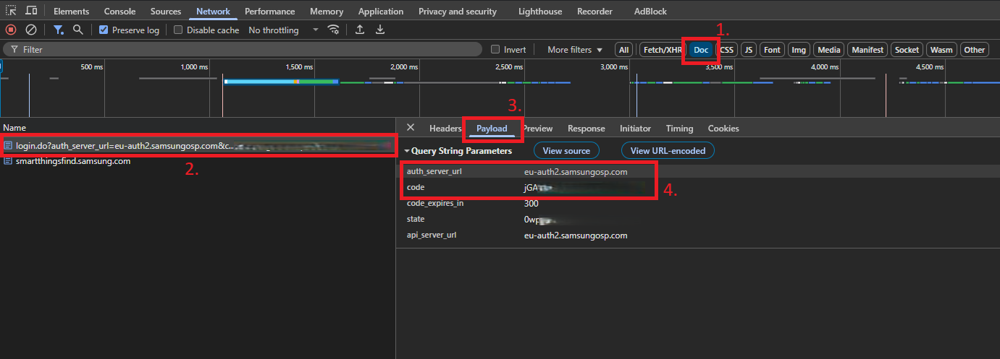

# Samsung Find Integration for Home Assistant

This integration adds support for devices from Samsung SmartThings Find. While intended mainly for Samsung SmartTags, it also works with other devices, such as phones, tablets, watches and earbuds.

Currently the integration creates three entities for each device:
* `device_tracker`: Shows the location of the tag/device.
* `sensor`: Represents the battery level of the tag/device (not supported for earbuds!)
* `button`: Allows you to ring the tag/device.

This integration does **not** allow you to perform actions based on button presses on the SmartTag!


## ⚠️ Important Warning/Disclaimer ⚠️

This Home Assistant integration uses an **OAuth client ID that belongs to a third party** (Samsung Find Application), not the author of this repository.

Using this client ID:

- Is **not officially supported** by the service provider.  
- May **stop working at any time** if the client ID is revoked.  
- Could potentially **violate the service’s Terms of Service (ToS)**.  
- Use this integration only for **personal or testing purposes**.  

**This integration is not officially supported by Samsung, and as such, using this integration could result in your account being locked out!** 

Please be aware that I am developing this integration to the best of my knowledge and belief, but can't give a guarantee. Therefore, use this integration **at your own risk**!

- **API Limitations**: This integration was created by reverse engineering the Samsung Find API.  
- **OAuth Flow**: It uses a reverse-engineered OAuth2 login process, which may stop working at any time if Samsung changes their systems.  
- **Feature Constraints**: The integration can only support features available on the [Samsung Find website](https://samsungfind.samsung.com/). For instance, stopping a SmartTag from ringing is not possible due to API limitations (while other devices do support this; not yet implemented)

## Notes on authentication
The integration simulates Samsung login using QR code. It stores the retrieved JSESSIONID-Cookie and uses it for further requests. **It is not yet known, how long exactly the session is valid!** While it did work at least for several weeks for me and others, there's no definite answer and the session might become invalid anytime! As a precaution I implemented a reauth-flow: In case the session expires, Home Assistant will inform you and you can easily repeat the QR code login process.

## Notes on connection to the devices
Being able to let a SmartTag ring depends on a phone/tablet nearby which forwards your request via Bluetooth. If your phone is not near your tag, you can't make it ring. The location should still update if any Galaxy device is nearby. 

If ringing your tag does not work, first try to let it ring from the [Samsung Find website](https://samsungfind.samsung.com/). If it does not work from there, it can not work from Home Assistant too! Note that letting it ring with the SmartThings Mobile App is not the same as the website. Just because it does work in the App, does not mean it works on the web. So always use the web version to do your tests.


## Installation Instructions

### Using HACS

1. Add this repository as a custom repository in HACS. Either by manually adding `https://github.com/tomskra/ha-samsung-find` with category `integration` or simply click the following button:

[](https://my.home-assistant.io/redirect/hacs_repository/?owner=tomskra&repository=ha-samsung-find&category=integration)

2. Search for "Samsung Find" in HACS and install the integration
3. Restart Home Assistant
4. Proceed to [Setup instructions](#setup-instructions)

### Manual install

1. Download the `custom_components/samsung_find` directory to your Home Assistant configuration directory
2. Restart Home Assistant
3. Proceed to [Setup instructions](#setup-instructions)

## Setup Instructions

[](https://my.home-assistant.io/redirect/config_flow_start/?domain=samsung_find)

1. Go to the Integrations page  
2. Search for "*Samsung Find*" 
3. Click on "*this link*" and your browser will be opened
4. Samsung login dialog will appear
5. Open Developer Tools (F12) in your browser and make click on Network tab and click on Preserve logs



6. Log-in to your Samsung account. After Successfull Login you will be redirected to Smarthings login web (don't do anything right now, just follow next instructions)
7. Follow the instructions below and copy the "*code*" and "*auth_server_url*" values: 



6. Enter values into Home Assistant.  
7. Wait a few seconds for the integration to be ready.

## Support
It’s been a fun challenge, but also a lot of hard work. If this integration has made your smart home a little more useful or convenient, and you’d like to show some support, a coffee is always appreciated. It helps keep the project going and makes the time spent on updates and improvements even more rewarding. ☕

[![BuyMeCoffee][buymecoffeebadge]][buymecoffee]

---

## Debugging

To enable debugging, you need to set the log level in `configuration.yaml`:

```yaml
logger:
  default: info
  logs:
    custom_components.samsung_find: debug
```

## Credits

Some logic used here is based on the [SmartThings Home Assistant integration](https://github.com/Vedeneb/HA-SmartThings-Find).  
Special thanks also to the work documented in the [uTag Wiki](https://github.com/KieronQuinn/uTag), which provided valuable insights.  


## License

This project is licensed under the MIT License. See the [LICENSE](LICENSE) file for details.

## Contributions

Contributions are welcome! Feel free to open issues or submit pull requests to help improve this integration.

## Support

For support, please create an issue on the GitHub repository.

## Roadmap

- No roadmap

## Disclaimer

This is a third-party integration and is not affiliated with or endorsed by Samsung or SmartThings.


[buymecoffee]: https://www.buymeacoffee.com/tomskra
[buymecoffeebadge]: https://img.shields.io/badge/buy%20me%20a-coffee-blue.svg?style=for-the-badge&logo=buymeacoffee&logoColor=ccc